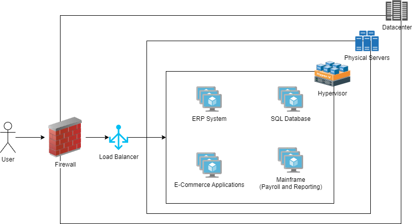
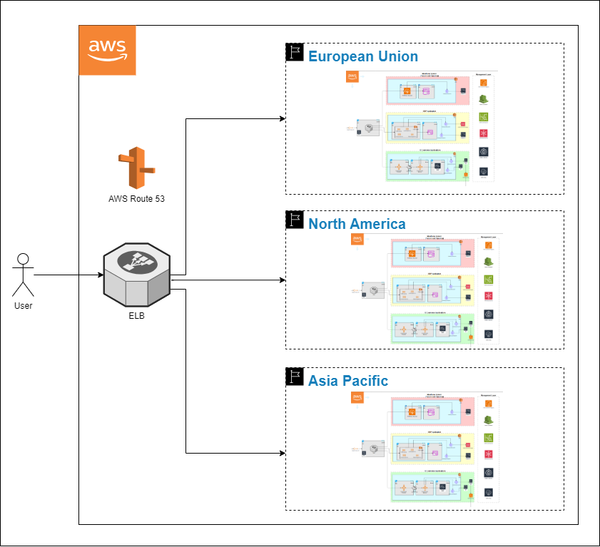
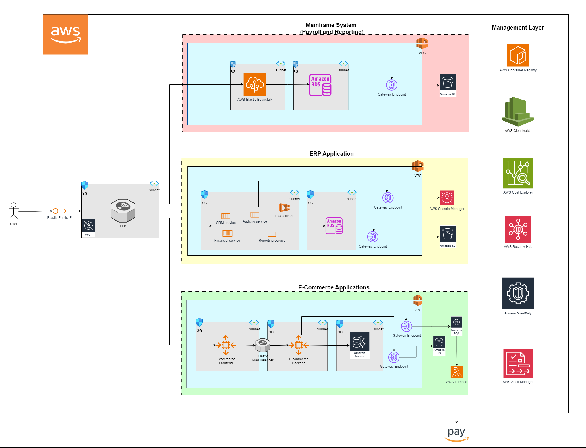

# 
Migration Project Report (Group - 3) 

## Group members:

1. Aakanksha Pharande
2. Savas Erturk
3. Seyfullah Burul
4. Talwinder Singh

## Company overview and Challenges

GlobalTech Solutions, a multinational company operating across 10 countries, currently relies on a diverse on-premises infrastructure. This includes 150 virtual machines (VMs) running both Windows Server and Linux, a monolithic ERP system for financial and inventory management, and public-facing e-commerce applications with stringent uptime requirements. The infrastructure also features an in-house SQL database cluster that houses sensitive customer and operational data, as well as a legacy mainframe system for payroll and reporting. With a mix of modern and legacy systems, maintaining seamless operations across multiple regions presents significant challenges.

The company faces rising operational costs related to its on-premises data centers and must address the impending end-of-support for its legacy ERP and mainframe systems. To support future growth, GlobalTech Solutions requires a scalable infrastructure with robust disaster recovery capabilities. Additionally, compliance with international regulations such as GDPR and HIPAA is essential. Given the critical nature of its services, minimizing downtime during migration is crucial, with a strict requirement that outages for critical systems do not exceed four hours.

## Objective of the report

In this report, we have outlined a comprehensive migration plan to transition all systems to the assigned cloud provider. Our design ensures scalability and modernization by leveraging cloud-native solutions and infrastructure best practices. We have detailed each migration step, focusing on cost efficiency and optimal performance, while addressing compliance with international standards such as GDPR and HIPAA. Security measures have been integrated into every phase to protect sensitive data. Additionally, our plan minimizes downtime and operational disruption, adhering to the strict requirement of limiting outages to under four hours for critical services. This report demonstrates how our approach successfully fulfills all the stated objectives.

During this phase, we will assess the current infrastructure using AWS tools to create a detailed migration strategy. We will utilize three AWS tools to help determine the migration approach:

## Phase 1: Initial Assessment of On-Premises Infrastructure (Week 1-4)

### AWS Tools Used

1. **AWS Migration Hub:**

   - Tracks the progress of migrating critical systems, such as the E-commerce application, across multiple regions.
   - Provides a central location to monitor migration activities and ensures everything stays on track.

2. **AWS Application Discovery Service:**

   - Gathers information about our on-premises systems, including virtual machines, the mainframe, and the SQL database.
   - Helps us understand dependencies and performance requirements, essential for a smooth migration.

3. **AWS Application Migration Service:**
   - Used to rehost the E-commerce application.
   - Automates workload migration, ensuring minimal downtime and a faster transition to AWS.

These are the steps we will follow to do a proper migration assessment.

### **STEP 1: Inventory Assessment**

Now that we have outlined the tools, the first step is performing an inventory assessment using the AWS Application Discovery Service:

- **VMs:** Identifying OS versions and software dependencies ensures compatibility with AWS instances and services.
- **ERP System:** Assessing the monolithic architecture aids in determining the best approach for containerization.
- **E-commerce Application:** Mapping front-end and back-end dependencies ensures smooth migration with minimal disruption.
- **SQL Database:** Mapping data flow and schema complexity ensures consistent data integrity and compliance.
- **Mainframe System:** Analyzing legacy code is essential for determining modernization requirements.

### **STEP 2: Risk and Compliance Analysis**

This step is crucial to ensure that workloads meet security and compliance requirements during and after migration.

### **STEP 3: Stakeholder Alignment**

In this step, we will conduct workshops with business leaders, IT teams, and stakeholders. This will help:

- Prioritize workloads based on business impact and dependencies.
- Align technical strategies with business goals.

The following represents the on-premises infrastructure of GlobalTech

The table below summarizes the initial assessment of the on premises infrastructure, including the setup, dependencies, challenges, and priority for migration of each system:

| **Component**                         | **Current Setup**                                                     | **Dependencies**                                                  | **Challenges**                                                                       | **Priority**                                                         |
| ------------------------------------- | --------------------------------------------------------------------- | ----------------------------------------------------------------- | ------------------------------------------------------------------------------------ | -------------------------------------------------------------------- |
| **Virtual Machines (VMs)**            | 150 virtual machines (VMs) running a mix of Windows Server and Linux. | Supports ERP system, e-commerce apps, and SQL databases.          | Requires planning for workload compatibility and resource provisioning in the cloud. | High priority for migration, as they are core to the infrastructure. |
| **Monolithic ERP System**             | Legacy ERP system supporting financial and inventory management.      | Integrated with SQL database and other business-critical systems. | Needs refactoring or rehosting to scale and integrate with cloud services.           | High priority for modernization due to end of support.               |
| **E-commerce Applications**           | Public-facing applications with strict uptime requirements.           | Interconnected with the database (frontend and backend).          | Minimizing downtime is critical due to strict uptime requirements.                   | High priority due to direct impact on business revenue.              |
| **SQL Database Cluster**              | Stores sensitive customer and operational data.                       | Critical for ERP and e-commerce applications.                     | Ensuring data consistency, security, and minimal downtime during migration.          | High priority due to handling sensitive data and integration.        |
| **Mainframe (Payroll and Reporting)** | Supports payroll and reporting, nearing the end of support.           | Integrated with legacy systems for payroll and reporting.         | Requires significant changes to architecture or code for modernization.              | Medium priority, supports critical processes but less urgent.        |

## Phase 2: Detailed Design & Preparation (Week 5-10)

In this phase we will plan the detailed architecture and get the environment ready for migration.

### E-commerce Application

The E-commerce application has been rehosted using AWS Auto Scaling Groups. This approach was chosen for its speed in migration and ability to automatically scale the application based on traffic, which ensures optimal performance during peak usage times. The application has been split into frontend and backend services, each hosted on their respective auto-scaling groups. Amazon Aurora serves as the database, providing high availability and performance. The architecture also includes AWS Lambda for serverless functions and Amazon SQS for managing queues. Amazon S3 is used for static content storage, enhancing the scalability and availability of the application.

### ERP System

The ERP system has been re-architected using Amazon ECS (Elastic Container Service) with a containerized approach. This allows the company to modernize the legacy system, making it more agile and scalable. The ERP system now runs in ECS clusters, with four containers handling different microservices. Amazon RDS supports the database, ensuring reliable storage and management of transactional data. The system integrates with AWS Secrets Manager for secure management of sensitive information and uses Amazon S3 for document and report storage. This re-architecture aligns with the goal of improving performance and ease of management while enabling container-based scalability.

### Mainframe System

The Mainframe system, which handles Payroll and Reporting, has been re-architected using AWS Elastic Beanstalk, which is ideal for simplifying the deployment of applications. This approach allows the legacy mainframe system to be migrated to a modern, scalable, managed solution. The mainframe system integrates with Amazon RDS for database needs, ensuring efficient handling of payroll data. Additionally, Amazon S3 is used for storing large volumes of data and reports, while AWS Gateway Endpoint ensures secure communication between the mainframe application and other services.

### Database Services

In line with the 12-factor app principles, each application (E-commerce, ERP, and Mainframe) has been assigned its own separate database service, moving away from the previous on-premises centralized database setup. This design ensures that each service is decoupled and can independently scale according to its own requirements, ensuring better data management, security, and performance.

### Global Multi-Region AWS Architecture for Data Residency Compliance and Latency Optimization

In this architecture, GlobalTech Solutions' infrastructure is replicated across three AWS regions: European Union (EU), North America (NA), and Asia-Pacific (APAC). This multi-region deployment ensures compliance with data residency laws, such as GDPR, by keeping data within its respective region. Additionally, by strategically distributing the company's infrastructure across these regions, latency is reduced for users by routing them to the nearest region, improving performance and responsiveness. AWS services, such as Elastic Load Balancer (ELB), will direct users to the closest regional infrastructure, ensuring high availability and seamless access regardless of geographical location. This design supports the company’s global expansion while meeting legal and performance requirements.

### Detailed Cloud Architecture for GlobalTech Solutions' Migration

In our cloud migration strategy for GlobalTech Solutions, we have successfully moved their core systems—E-commerce Application, ERP System, and Mainframe System—to AWS using tailored approaches for each based on their unique requirements. This migration is designed to enhance scalability, ensure compliance, and improve operational efficiency.

## Phase 3: Migration Execution (Week 11-16)

Before we begin migrating the on-premises infrastructure to the cloud, it is crucial to clearly define the responsibilities for various tasks. The RACI matrix is a useful tool for assigning and clarifying these responsibilities across the team.
R- Responsible, A - Accountable, C - Consulted, I - Informed.

This is RACI matrix that is followed for this project:
| Task/Activity | Cloud Architect | Project Manager | DevOps Team | Security Team | Business Stakeholders |
|---------------------------|-----------------|-----------------|-------------|---------------|-----------------------|
| **Assessment Phase** | R/A | C | R | I | I |
| **Migration Planning** | R/A | R/A | C | C | I |
| **Infrastructure Setup** | R | A | R | C | I |
| **E-commerce Migration** | R | A | R | C | I |
| **ERP Migration** | R | A | R | C | I |
| **Mainframe Migration** | R | A | R | C | I |
| **Security Configuration** | C | A | R | R/A | I |
| **Cost Monitoring Setup** | C | R/A | R | C | I |
| **Monitoring and Logging** | R | A | R | C | I |
| **Threat Detection Setup** | C | A | R | R/A | I |
| **Compliance Auditing** | C | A | R | R/A | I |
| **Stakeholder Communication** | I | R/A | I | I | R |

### 1. E-commerce Applications Migration Execution – Rehosting

#### Steps:

1. **Setup AWS Auto Scaling Groups:**

   - Create two Auto Scaling Groups (ASG): one for the frontend and one for the backend.
   - Define scaling policies to handle peak traffic and ensure high availability.

2. **Database Migration to Amazon Aurora:**

   - Use AWS Database Migration Service (DMS) to migrate the on-premises SQL database to Aurora.
   - Set up replication to keep data consistent during the cutover process.
   - Ensures minimal downtime and data integrity during migration.

3. **Static Content Migration to Amazon S3:**

   - Copy all static files to an S3 bucket.
   - Update the frontend to retrieve static content from S3.
   - Reduces server load and improves content delivery.

4. **Lambda and SQS Setup:**
   - Deploy Lambda functions for specific backend processes.
   - Configure SQS for managing backend task queues (e.g., order processing).
   - Enhances the application's ability to handle background processes efficiently.

### 2. ERP Applications Migration Execution – Rearchitecting

#### Steps:

1. **Containerize ERP Microservices:**

   - Break down the monolithic ERP system into microservices: CRM, Auditing, Financial, and Reporting.
   - Package each microservice into a Docker container.
   - Store container images in AWS Elastic Container Registry (ECR).

2. **Deploy Containers on Amazon ECS:**

   - Create an ECS cluster and deploy containers for each microservice.
   - Define task definitions and service scaling policies.

3. **Database Migration to Amazon RDS:**

   - Use AWS DMS to migrate ERP data from the on-prem SQL cluster to Amazon RDS.
   - Set up automated backups and Multi-AZ deployment for high availability.

4. **Integrate with AWS Secrets Manager:**
   - Store and manage ERP secrets in Secrets Manager.
   - Update application code to retrieve secrets dynamically.

### 3. Mainframe System Migration Execution – Rearchitecting

#### Steps:

1. **Deploy on AWS Elastic Beanstalk:**

   - Package the mainframe application and deploy it to Elastic Beanstalk.
   - Configure environment variables, load balancing, and auto-scaling settings.

2. **Database Migration to Amazon RDS:**

   - Use AWS DMS to migrate payroll data to Amazon RDS.
   - Set up read replicas to support reporting without affecting performance.

3. **Store Reports on Amazon S3:**
   - Configure the application to save reports directly to S3.
   - Set up lifecycle policies to archive or delete old reports.

### 4. Management Layer Deployment

#### Steps:

1. **AWS CloudWatch:**

   - Set up CloudWatch alarms and dashboards for each application.
   - Enable log streaming for performance monitoring and troubleshooting.

2. **AWS Security Hub:**

   - Integrate Security Hub with all services to monitor security posture.
   - Set up automated compliance reports.

3. **AWS Cost Explorer:**

   - Enable Cost Explorer to monitor resource usage.
   - Set up budgets and alerts to control costs.

4. **AWS GuardDuty and AWS Audit Manager:**
   - Deploy GuardDuty for continuous threat detection.
   - Use Audit Manager to automate audit processes.

## Phase 4: Validation and Testing (Week 16 - 18)

Validation and Testing is a critical phase in the migration process, ensuring that all migrated applications and services perform as expected in the new AWS environment. This phase involves rigorous testing to verify the functionality, performance, security, and reliability of each system.

Below are the ways to test the functionality for each component. By identifying and addressing potential issues before going live, following the below steps help ensure a smooth transition with minimal operational disruption.

### 1. Testing E-commerce Applications

- **End-to-End Testing:** Perform comprehensive testing in a staging environment.
- **Connectivity Validation:** Verify frontend and backend connectivity.
- **Database Integrity:** Ensure data consistency post-migration.
- **Static Content Delivery:** Validate that all static assets are served correctly from S3.

### 2. Testing ERP Applications

- **Microservice Validation:** Independently test each microservice (CRM, Auditing, Financial, Reporting).
- **ERP Workflow Testing:** Validate the entire ERP workflow to ensure functionality.
- **Data Consistency:** Verify data integrity and performance in Amazon RDS.

### 3. Testing Mainframe System

- **Payroll Cycle Validation:** Run test payroll cycles to confirm accurate processing.
- **Report Verification:** Ensure reports are generated and stored correctly in S3.
- **Data Processing:** Verify data integrity and consistency in RDS.

### 4. Testing Management Layer

- **Monitoring Validation:** Confirm CloudWatch alarms trigger correctly and dashboards display accurate data.
- **Security Checks:** Ensure Security Hub detects and reports security issues.
- **Cost Monitoring:** Validate that Cost Explorer accurately tracks resource usage and budget alerts function.

## Compliance With International Standards

To ensure the company follows important laws like GDPR (General Data Protection Regulation) and HIPAA (Health Insurance Portability and Accountability Act), here’s what we need to do:

### General Data Protection Regulation (GDPR)

The GDPR provides comprehensive regulation for the protection of personal data and increases the responsibility of companies to protect the privacy rights of individuals. This regulation aims to prevent the misuse of personal data by ensuring that data is collected, processed and stored securely. The GDPR is a global law that affects companies both within and outside the EU, so organizations need to comply with this regulation.

**Data Location:**
The company’s data infrastructure is spread across different regions, including the EU, North America, and Asia-Pacific. This helps meet GDPR requirements, which require that personal data stays within its respective region.

**Data Processing Agreement (DPA):**
We need to sign a Data Processing Agreement with the cloud provider that explains how they process the company's data in accordance with the GDPR, and also fulfill the obligations of these agreements.

**Data Encryption:**
The services above provide a comprehensive solution for managing data encryption in the AWS environment. While AWS KMS offers a centralized service for managing encryption keys, data encryption can be implemented through services such as Amazon S3, RDS, and EBS. Additionally, encryption can be ensured during data transmission with ACM. These services are essential for enhancing security and ensuring compliance with legal regulations.

**Access Control and Logging:**
To track and log access to data, AWS provides several tools that can help meet GDPR's requirements for monitoring personal data access. AWS CloudTrail records all API calls and user activities within the AWS environment, allowing you to monitor who accessed what data and when. AWS CloudWatch Logs can capture detailed logs from applications and services, providing visibility into access patterns.

### Health Insurance Portability and Accountability Act (HIPAA)

HIPAA provides comprehensive regulations to secure health information. Healthcare organizations must collect, process, store, and share personal health information only within legal frameworks. Additionally, appropriate measures must be taken to protect patient privacy, ensure data security, and comply with regulatory requirements. Compliance with HIPAA creates a secure healthcare environment for both healthcare organizations and individuals. The articles mentioned above in the GDPR section are also valid for HIPAA, and we can list some additional articles in this section.

**Protecting Health Data:**
If the company deals with health information, the cloud provider must offer services that comply with HIPAA for secure storage and processing. A Business Associate Agreement (BAA) must be signed to ensure HIPAA standards are met.

**Disaster Recovery:**
In the event of a natural disaster, technical failure, or attack, data centers may become unavailable or inaccessible. To address this, AWS offers several solutions:
AWS Regions and Availability Zones: Data is backed up across multiple AWS regions and availability zones (AZs). If an issue occurs in one region, data from another region can be accessed, minimizing service disruptions. Amazon Route 53: DNS routing ensures that in the event of a disaster, traffic is automatically directed to healthy regions, maintaining service continuity. AWS Elastic Load Balancer (ELB): Load balancing is used to distribute traffic across different regions, ensuring that even if one region goes down, services continue to run smoothly.

## Development of Security Measures

### Encryption:

**Encrypting Data in Transit:**
We will protect data when it is being sent over the internet by using secure methods like SSL/TLS. This keeps the data safe while moving from one place to another.

**Encrypting Data at Rest:**
We will make sure that data stored on servers is encrypted using AWS Key Management Service (KMS). This means that even if someone gains access to the storage, they won’t be able to read the data without the proper keys.

**End-to-End Encryption for Sensitive Data:**
Sensitive data, like personal or financial information, will be protected with encryption from start to finish. It will be encrypted when sent, while stored, and only authorized people can access it.

### Identity and Access Management (IAM)

**Set Up IAM Roles:**
We will define who has access to specific data and services within the organization by setting up IAM roles and policies. This ensures that each person has the least privilege access, meaning they can only access the data or systems they need for their job, reducing the risk of unauthorized access.

**Use Multi-Factor Authentication (MFA):**
For added security, we will require Multi-Factor Authentication (MFA) for all users, especially those accessing sensitive or critical data. MFA requires users to verify their identity using two forms of identification: something they know (like a password) and something they have (like a mobile device or token). This extra step ensures that even if someone’s password is compromised, unauthorized access is still prevented.

**Identity Federation:**
We will enable Identity Federation to allow users to log in using their existing corporate accounts, such as Active Directory or Azure AD. This simplifies login management across the organization, while also providing a single set of credentials to access multiple AWS resources, making it easier to manage and secure user access.

## Disaster Recovery and Backup

**Backup Data Regularly:**
To protect against data loss, we will automatically back up all important data and systems. Services like Amazon S3 and Amazon RDS will be used to store backups securely. These backups will be stored in multiple AWS regions so that if one region has an issue, the data can still be accessed from another region. This helps ensure that the data is safe and available even if something goes wrong in one location.

**Disaster Recovery Plan:**
We will create a clear plan for how to quickly recover data and systems if something goes wrong. This plan will use AWS Backup to keep copies of data in different regions. If there is a problem in one region, Amazon Route 53 will automatically send traffic to a healthy region, helping the company stay online. We will make sure that all important systems like the E-commerce app, ERP system, and Mainframe system can be quickly restored, so there is little to no downtime.

**Test Disaster Recovery:**
We will regularly test the disaster recovery plan to make sure it works when needed. Tools like AWS Elastic Disaster Recovery (AWS DRS) will let us practice restoring systems, so we can be sure they can recover quickly. AWS CloudFormation can help automate the recovery tests, and AWS Lambda and Amazon CloudWatch will help manage and monitor these tests. By doing regular tests, we can make sure the recovery process is fast and reliable and fix any issues before they become a problem.

## Compliance Roadmap and Include Data Governance Policies

### Compliance Roadmap

**Phase 1: Discovery and Assessment (Weeks 1-4)**

Review the company’s data to identify where sensitive information is stored.
Set up a compliance team to ensure all regulations are followed during the cloud migration.

**Phase 2: Architecture and Design (Weeks 5-10)**

Make sure that security features like data encryption, access control, and backup strategies are included in the cloud infrastructure.
Conduct a Data Protection Impact Assessment (DPIA) to identify any risks related to the company’s data processing.

**Phase 3: Execution and Validation (Weeks 11-16)**

Test the cloud setup to ensure all security and compliance requirements are in place.
Perform internal audits to make sure everything is working as planned and there are no compliance issues.

### Data Governance Policies

Data Governance Policies help manage and protect data properly. First, Data Ownership means deciding who is responsible for the data and making sure it's protected. This way, a specific person or team knows they are in charge of keeping the data safe and following rules like HIPAA and GDPR. Next, Data Retention is about keeping data only as long as needed. After a certain period, old data should be archived or deleted automatically to reduce the risk of keeping unnecessary or outdated information. Lastly, Access Control and Monitoring are about setting rules for who can see or use the data. Tools like AWS IAM, CloudTrail, and CloudWatch can track and log who accesses the data to make sure everyone follows the rules. By having clear rules and using the right tools, organizations can keep their data safe, organized, and compliant with the law.  
We can use automated monitoring and reporting tools to ensure that all compliance regulations are met. To ensure compliance with regulations, AWS offers several tools that help automate monitoring, auditing, and reporting. AWS CloudTrail records all user activities and API calls, providing a log of actions taken within the AWS environment, which is essential for audit purposes. AWS Config tracks the configuration of AWS resources and ensures they align with internal and external compliance standards. AWS Security Hub collects security findings from various AWS services, offering a centralized view of your security status.

### AWS Services Pricing Summary

| Service Name                      | Region                | Monthly Cost (USD) | Yearly Cost (USD) |  Summary                                                                                     |
|-----------------------------------|-----------------------|---------------------|-------------------|----------------------------------------------------------------------------------------------------|
| AWS Fargate                       | US East (Ohio)        | 4,253.02           | 51,036.24         | Operating system (Linux), CPU Architecture (x86), Avg duration (14400 minutes), 10 tasks per day. |
| Amazon RDS for SQL Server         | US East (Ohio)        | 6,931.72           | 83,180.64         | Storage (100 GB), Instance type (db.m4.2xlarge), Multi-AZ, Enterprise license included.           |
| Amazon Simple Storage Service (S3)| US East (Ohio)        | 30.79              | 369.48            | S3 Standard storage (1 TB), Glacier Flexible Retrieval storage (2000 GB).                        |
| Amazon Route 53                   | US East (Ohio)        | 524.00             | 6,288.00          | Hosted Zones (3), Additional Records (15000).                                                     |
| Elastic Load Balancing            | US East (Ohio)        | 133.23             | 1,598.76          | Number of Application Load Balancers (1).                                                         |
| Amazon Elastic Graphics           | US East (Ohio)        | 292.00             | 3,504.00          | Instance type (eg1.2xlarge), Number of nodes (1).                                                 |
| Amazon EC2                        | US East (Ohio)        | 1,528.50           | 18,342.00         | 150 instances, t4g.nano, EBS storage (100 GB).                                                    |
| Amazon EC2                        | Europe (Frankfurt)    | 1,866.00           | 22,392.00         | 150 instances, t4g.nano, EBS storage (100 GB).                                                    |
| Amazon Elastic Graphics           | Europe (Frankfurt)    | 543.12             | 6,517.44          | Instance type (eg1.2xlarge), Number of nodes (1).                                                 |
| Elastic Load Balancing            | Europe (Frankfurt)    | 136.51             | 1,638.12          | Number of Application Load Balancers (1).                                                         |
| Amazon Route 53                   | Europe (Frankfurt)    | 524.00             | 6,288.00          | Hosted Zones (3), Additional Records (15000).                                                     |
| Amazon Simple Storage Service (S3)| Europe (Frankfurt)    | 30.79              | 369.48            | S3 Standard storage (1 TB), Glacier Flexible Retrieval storage (2000 GB).                        |
| Amazon RDS for SQL Server         | Europe (Frankfurt)    | 7,099.54           | 85,194.48         | Storage (100 GB), Instance type (db.m4.2xlarge), Multi-AZ, Enterprise license included.           |
| AWS Fargate                       | Europe (Frankfurt)    | 4,891.06           | 58,692.72         | Operating system (Linux), CPU Architecture (x86), Avg duration (14400 minutes), 10 tasks per day. |
| Amazon EC2                        | Asia Pacific (Sydney) | 1,878.00           | 22,536.00         | 150 instances, t4g.nano, EBS storage (100 GB).                                                    |
| Amazon Elastic Graphics           | Asia Pacific (Sydney) | 519.76             | 6,237.12          | Instance type (eg1.2xlarge), Number of nodes (1).                                                 |
| Elastic Load Balancing            | Asia Pacific (Sydney) | 135.20             | 1,622.40          | Number of Application Load Balancers (1).                                                         |
| Amazon Route 53                   | Asia Pacific (Sydney) | 524.00             | 6,288.00          | Hosted Zones (3), Additional Records (15000).                                                     |
| Amazon Simple Storage Service (S3)| Asia Pacific (Sydney) | 33.23              | 398.76            | S3 Standard storage (1 TB), Glacier Flexible Retrieval storage (2000 GB).                        |
| Amazon RDS for SQL Server         | Asia Pacific (Sydney) | 7,134.88           | 85,618.56         | Storage (100 GB), Instance type (db.m4.2xlarge), Multi-AZ, Enterprise license included.           |
| AWS Fargate                       | Asia Pacific (Sydney) | 5,098.38           | 61,180.56         | Operating system (Linux), CPU Architecture (x86), Avg duration (14400 minutes), 10 tasks per day. |
|-----------------------------------|-----------------------|---------------------|-------------------|----------------------------------------------------------------------------------------------------|
| Total                             | -                     | 44,107.73          | 529,292.76        | -                                                                                                 |

## Future Growth Strategy

### 1. Multi-Region Deployment
- **Description**: Spread workloads across AWS regions for better performance and redundancy.
- **Benefits**: Enhances scalability, fault tolerance, and compliance with local regulations.
- **Action**: Use region-based auto-scaling and load balancing.

### 2. Serverless Architectures
- **Description**: Transition to serverless services like AWS Lambda for new applications.
- **Benefits**: Pay only for what you use, reducing idle costs.
- **Action**: Develop event-driven workloads and APIs with serverless frameworks.

### 3. Data Analytics Expansion
- **Description**: Build a scalable analytics platform with AWS Glue, Redshift, and Athena.
- **Benefits**: Gain advanced reporting, real-time insights, and machine learning capabilities.
- **Action**: Invest in analytics tools as data grows.

### 4. Continuous Monitoring
- **Description**: Monitor usage with AWS CloudWatch and Budgets.
- **Benefits**: Optimize costs and manage resources proactively.
- **Action**: Set up CloudWatch alarms and budget alerts.
