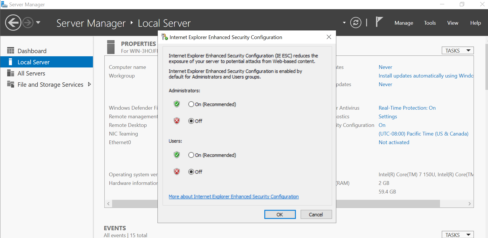

# VM Migration Lab Report - Submitted by - Talwinder Singh(040952048) and Aakanksha Pharande (041075173)

## Milestone 1: Environment Setup
In this milestone, we set up two virtual machines (VMs) in **VMware Workstation Pro**.
- **VM1**: Windows Server 2022 (will be migrated to **Azure**).
- **VM2**: Windows Server 2019 (mobility server for migration).

## Milestone 2: OS Installation
- **Windows Server images** were obtained from the **Azure Education portal** and successfully installed on both VMs.
- Both servers were configured and running, and the **firewall was disabled** on both VMs to prevent connectivity issues during migration.

### Screenshots for Milestone 2:

## Milestone 3: Application Deployment
To verify the setup, we installed **IIS (Internet Information Services)** on **VM1** (Windows Server 2022).
- Created a simple **index.html** file with the content "Hello World" and placed it in `C:\inetpub\wwwroot\`.
- Verified the deployment by navigating to `http://localhost`, where the **"Hello World"** web application was accessible.

### Screenshots for Milestone 3:

## Milestone 4: Migration Assessment
The next step was to conduct a migration assessment:
1. Created an **Azure Migrate Project** and downloaded the **Azure Migrate appliance** to **VM1** (Windows Server 2022).
2. Ran the **Azure Migrate Discovery** tool on **VM1** to gather the necessary details for the migration.
3. Chose the **Physical machine migration** option in the Azure Project and ran the discovery tool via **PowerShell** on **VM1** to assess its readiness for migration.

### Screenshots for Milestone 4:

## Milestone 5: VM Migration Execution
We proceeded to execute the VM migration:
1. Downloaded the **replication appliance** software onto **VM2** (Windows Server 2019) to facilitate the migration.
2. Configured **static IP addresses** on both VMs to ensure successful replication.
3. Entered the necessary **credentials** for **VM1** (Windows Server 2022) to initiate replication.
4. In the **Azure Portal**, we configured the replication by selecting **VM2** (the mobility server) as the configuration server.
5. Installed and ran the **Azure Migrate tool** on **VM1** to start the replication process, using the static IP of **VM2** (mobility server).
6. Triggered the **replication** of **VM1** to **Azure** with default settings (resource allocation, virtual network, etc.).
7. Created a **virtual network** in Azure to be used when the VM is migrated.

Once replication was completed, the migration process started:
1. We retained the default settings for migration (resource allocation and network assignments).
2. After migration was completed:
   - Assigned a **public IP** to the VM in **Azure**.
   - Configured **RDP access** and tested the connection.

Finally, we accessed **localhost** on the migrated VM and confirmed that the "Hello World" web application was functioning exactly as it did on the physical server.

### Screenshots for Milestone 5:

## Milestone 5: Validation and Failover Testing
## Challenges Encountered  

### 1. Static IP Configuration  
During the setup, we encountered an issue with IP address assignments. Both VMs were initially configured with dynamic IPs, which caused certain tests to fail during the replication process.  

**Solution:**  
We reconfigured the network settings on both VMs to use **static IP addresses**, ensuring stable communication and successful test completion.  

### 2. Outdated Mobility Service  
Another challenge arose during the replication phase. The **Windows Server 2022 VM** had an outdated version of the **Mobility Service** installed, which resulted in a **Critical Health** status.  

**Solution:**  
To resolve this, we reinstalled the mobility software by running the updated `.exe` file. Once the software was updated, the replication process resumed successfully without further issues.  
