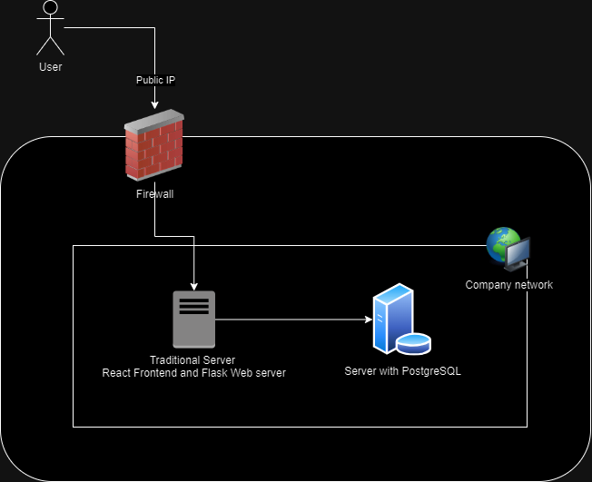
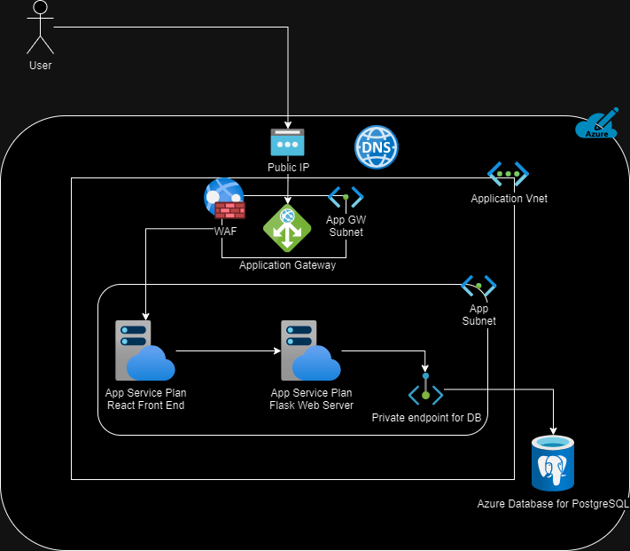

# Lab2 - IaaS/PaaS Architecture

## On-Prem Architecture

The On-Premises architecture uses traditional physical or virtual servers hosted within the company's private network. A firewall protects the system from external access, and the frontend and backend servers communicate within the local network. In this setup, React and Flask are hosted together on a server, while PostgreSQL is on a separate database server within the same environment.

## IaaS Architecture

This architecture follows a Lift-and-Shift approach. It consists of a public-facing frontend virtual machine (VM) running React and a backend setup with a Flask Web Server and a database VM with PostgreSQL installed on it. The network is managed through Azure's Virtual Network (VNet), with separate subnets for frontend/backend components for network segregation and all resources are protected by Network Security Groups (NSGs). A Load Balancer ensures traffic distribution between the Flask VMSS. Since this is an IaaS model, we manage the OS and runtime for each VM, which provides flexibility but also adds management overhead.

## PaaS Architecture

In this model, the application might need to be refactored to take advantage of Azure's managed PaaS offerings. The application components are hosted using Azure App Service Plans for both the React Frontend and Flask Web Server. This reduces the need to manage VMs, automatically handling scaling and updates. A fully managed Azure Database for PostgreSQL is utilized and is connected to via a private endpoint, ensuring secure communication. An Application Gateway with a Web Application Firewall (WAF) manages traffic, and all services are hosted within a Virtual Network. This approach minimizes management overhead, focusing more on the app and improving security through built-in Azure features.

