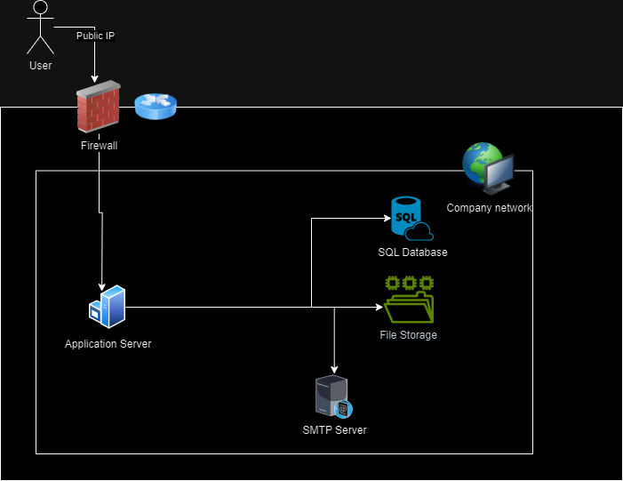

# Section 1: On-Premises Solution Design
The technical architecture diagram illustrates the on-premises infrastructure of a mid-sized retail company. At its core is a Web Application structured as a monolithic system, hosted on physical servers, which limits scalability. The Backend Database on an SQL server manages essential data, while file storage is handled through a Local File System, allowing quick access but posing challenges for remote access. Networking is managed by company-operated routers and firewalls, ensuring secure data traffic. Additionally, an Email Service supports client notifications, facilitating timely communication.

# Section 2: Migration Strategies

## 1. Web Application - Migration to Azure Virtual Machine (IaaS)
For migrating the web application, I will use the Lift and Shift strategy to move it to Azure Virtual Machines (VMs) under Azure's IaaS model. This approach will let me move the application with minimal changes while keeping full control over the environment.

### Migration Steps:
1. Set Up VMs: Create virtual machines in Azure with the same CPU, memory, and storage as the current on-premises servers.
2. Install Software: Install necessary software and runtime environments to replicate the on-premises setup.
3. Migrate Application: Transfer the application’s code and configuration files to the Azure VM.
4. Test and Validate: Test the application post-migration to ensure proper functionality and performance.

### Reason Behind This Strategy:
1. Minimal Changes: Ideal for monolithic applications; the application can be moved without modifying architecture or code.
2. Full Control: More control and flexibility over the infrastructure for updates and configurations.
3. Quick Adoption: Rapid cloud integration without extensive rework, saving time and costs.

## 2. Database - Migration to Azure SQL Database (PaaS)
For migrating the database, I will use the Azure SQL Database service, a fully managed relational database in Azure. This will involve making adjustments to the database schema and configurations to leverage Azure’s features.

### Migration Steps:
1. Assess Current Database: Thorough assessment of the existing SQL Server database.
2. Choose Service Tier: Select the appropriate service tier based on application needs.
3. Migrate Database: Use Azure Database Migration Service to transfer the database.
4. Test and Validate: Check database functionality, data integrity, and performance post-migration.

### Reason Behind This Strategy:
1. Optimized Performance: Minor adjustments improve performance and utilize Azure's capabilities.
2. Managed Service: Automates backups, updates, and scaling, reducing workload.
3. Scalability: Easy adjustments for growing business needs.
4. High Availability: Built-in features ensure accessibility and security.

## 3. File Storage - Migration to Azure File Share via Azure Storage Account (PaaS)
For migrating file storage, I will use the Refactor strategy by transitioning to Azure File Share, part of an Azure Storage Account.

### Migration Steps:
1. Create an Azure Storage Account: Set up a storage account for Azure File Share.
2. Set Up Azure File Share: Create an Azure File Share that reflects the current file structure.
3. Transfer Files: Move all files from on-premises storage to Azure File Share.
4. Configure Access: Set up access methods for users to connect to Azure File Share.
5. Test and Validate: Test file accessibility and permissions post-migration.

### Reason Behind This Strategy:
1. Seamless Integration: Easy transfer from on-premises to Azure, compatible with existing workflows.
2. Cost-Effective: Flexible pricing models for storage.
3. Easy Access: Files can be accessed remotely.
4. Managed Service: Fully managed by Azure, reducing infrastructure maintenance.

## 4. Networking - Migration to Azure Cloud-Native Networking (IaaS)
For the networking component, we will utilize Azure's cloud-native networking solutions.

### Migration Steps:
1. Set Up Azure Virtual Network (VNet): Create Azure VNet for secure resource connectivity.
2. Configure Subnets: Divide VNETs into subnets to separate resource types.
3. Implement Network Security Groups (NSGs): Control traffic flow with NSGs.
4. Establish VPN Gateway: Configure a secure connection between on-premises infrastructure and Azure.
5. Establish Private Endpoint for Storage Account: Enable secure access to the Azure Storage Account.
6. Test Connectivity: Ensure effective communication between components and functionality of security rules.

### Reason Behind This Strategy:
1. Simplified Management: Centralized management of networking resources.
2. Enhanced Performance: Optimize application performance and reduce latency.
3. Improved Security: Utilize NSGs and private endpoints for enhanced security.
4. Scalability: Easily scale networking services for increased traffic needs.

## 5. Email Service - Migration to Microsoft 365 (SaaS)
For the email service migration, I will use Microsoft 365.

### Migration Steps:
1. Set Up Microsoft 365 Account: Create a Microsoft 365 account and configure necessary domains.
2. Migration of Mailboxes: Transfer existing email data to Microsoft 365.
3. Update DNS Settings: Update DNS records to point to Microsoft 365.

### Reason Behind This Strategy:
1. Ease of Use: User-friendly interface.
2. Managed Service: Microsoft 365 manages the infrastructure, security, and updates.
3. Integration: Seamless integration with other Microsoft applications.
4. Scalability: Easily scale email services to accommodate growth.
