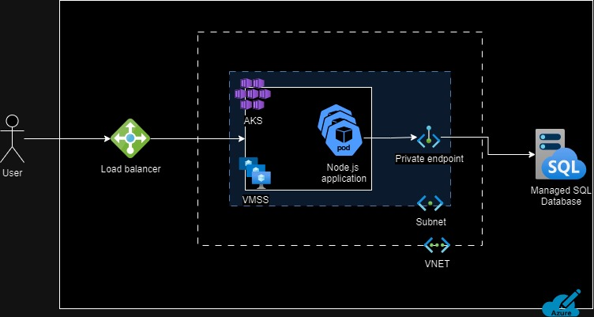

# 1. Technical Architecture Diagram 

# 2. Target Architecture Description
The user connects to the web application through a public IP. The traffic from the user is distributed evenly by the load balancer to the instances of the Node.js application running in the Kubernetes cluster. This makes sure the system is resilient even during peak loads. AKS is responsible for running and orchestrating the application containers that are deployed inside pods. The containers are encapsulated with all the needed dependencies. Based on the traffic or resource utilization the AKS cluster adds or removes pods horizontally using the horizontal pod autoscaling feature, thus providing high availability and scalability. The orchestrator provides high availability by replacing the failed pods with new pods. The virtual machine scale set underlying the AKS cluster makes sure that adequate computing resources are available and if necessary, scales automatically based on the resource demands. The private endpoint allows a secure private connection to the managed SQL database, instead of going over the public internet. The managed SQL database is a fully managed PaaS solution that comes with built-in security features and automatically scales and provides high availability. 

# 3. Steps of Migration
## Containerization of the web application:
To containerize the Node.js web application into a docker container, we first will need to create a docker file which will be used to build the docker image. The image will have the application package with all its dependencies so that it can run consistently in any environment. We can then store the container image in a container registry such as the Azure container registry. We will then deploy the application to a Kubernetes cluster with Horizonal pod auto-scaler enabled so that it can add the instances on demand. 

## Migration of the database to a managed SQL service:
For migrating the on-prem database to a managed SQL database service, we can first use Azure Migrate to assess the on-premises database and check for compatibility issues. Based on the database assessment recommendations, we can select the pricing tier, SKU, and compute level. After the assessment, we can set up a new Azure SQL database service and can export the data from the old database to this SQL instance.

## Configuration of the Kubernetes cluster for high availability: 
To ensure high availability of the application it is crucial to assess multiple factors like the type of application, its criticality, the service level agreement (SLA), and the budget. High availability requires planning for various types of failure and then configuring a resiliency option based on the needs. Cost is an important aspect to consider as it will increase as you move to the most resilient option. Additionally, for high availability, it is important to enable auto-scaling on the Kubernetes cluster so that it will scale up and down based on demand.

Failure domains and solutions for high availability: 
| Failure domains      | Example Issue                               | Solution/ Configuration                                                                                       | Cost  |
|----------------------|--------------------------------------------|--------------------------------------------------------------------------------------------------------------|-------|
| Pod level            | Application pod crashes                    | Multiple instances of application pods to redirect the request from the failed pods to the working pod.     | $     |
| Data center level     | Power outage in data center                | Deploy the AKS cluster across multiple availability zones to make the application resilient to data center level issues. | $$    |
| Regional level       | Natural disaster in a region              | Deploy the AKS cluster in two regions and load balance the traffic between the two. This will ensure that the application is available even if the whole region is wiped out. | $$$   |
