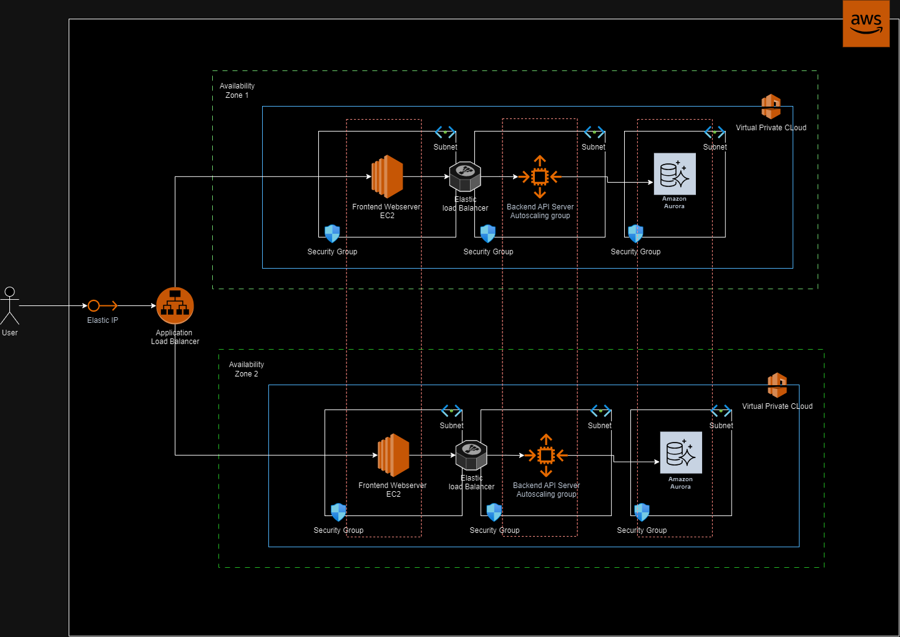

# Overview of Technical Architecture Diagram
The existing on-premise application will be rehosted to AWS with minimal changes using a Lift-and-Shift approach. 
The cloud-native architecture proposed uses AWS services to ensure scalability, high availability, and disaster recovery. The frontend tier consists of EC2 instances running in multiple Availability Zones (AZs) behind an Application Load Balancer (ALB). The ALB distributes incoming traffic evenly across the EC2 instances in different AZs, providing fault tolerance in case of an AZ failure. The backend tier includes EC2 instances running the API servers, which are part of an auto-scaling group to handle varying loads. These instances are also distributed across multiple AZs and sit behind a elastic load balancer (ELB) to ensure even traffic distribution and failover. For the database tier, Amazon Aurora is used, providing a fully managed, highly available, and auto-scaling SQL database. Aurora ensures data is automatically replicated across multiple AZs for redundancy, ensuring data consistency and availability. All components are hosted within a Virtual Private Cloud (VPC) with subnets in two AZs, and security groups protect the different tiers by controlling traffic flow between them.

# Addressing Scalability, Availability, and Disaster Recovery
**Scalability**: The backend tier is in an auto-scaling group, so it can automatically scale up or down based on traffic load. This makes sure the backend can handle traffic spikes without manual intervention, maintaining performance and efficiency. The frontend tier is distributed across multiple AZs with load balancing, which helps manage traffic more effectively.

**Availability**: The architecture is designed across two Availability Zones (AZ1 and AZ2). If one AZ fails, the load balancers will route traffic to the healthy AZ, ensuring minimal downtime and uninterrupted service for the users.

**Disaster Recovery**: The use of Amazon Aurora ensures that the data is automatically replicated across multiple AZs. In case of an outage, failover to another zone happens automatically, ensuring data consistency and high availability. Backup strategies using regular snapshots help restore operations with minimal downtime and safeguards against data loss or extended outages.

# Migration Process
## 1. Assessment : 
Use AWS Application Discovery Service to analyze the current on-premise infrastructure.Identify any potential risks and necessary modifications before migrating.

## 2. Rehosting (Lift-and-Shift):
Use AWS Server Migration Service (SMS) to move the existing frontend and backend servers (WebAppVM and APIVM) to AWS EC2 instances. Ensure the application runs in the same configuration, with minimal code changes.

## 3. Database Migration:
Migrate the on-premise SQL database to Amazon Aurora using AWS Database Migration Service (DMS).Ensure data consistency by validating data before and after migration. For large datasets, perform migration in phases to minimize downtime.

## 4. Testing:
Perform comprehensive testing after migration including unit, integration, and load testing to ensure the application works as expected in the new cloud environment. Test the load balancers, auto-scaling for the backend, and database performance.

## 5. Data Consistency Checks:
Run data integrity checks to compare source (on-premise) and target (AWS) databases. Use validation tools provided by AWS DMS to verify the consistency of migrated data.

## 6. Rollback Strategy:
Prepare a rollback plan using snapshots or backups of both the application and database in case any issues arise post-migration. Set checkpoints during the migration to ensure the system can revert to the original on-premise setup if required.

